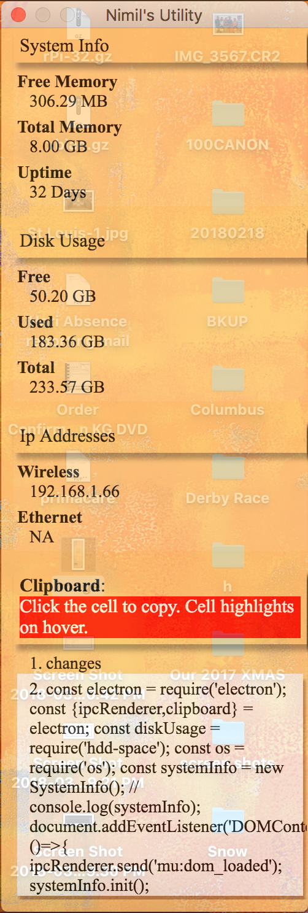

# SysInfo
System info is a utility that can display the following info,
1. System Info
    1. Free Memory
    1. Total memory
    1. Number of days since the machine is on.
    
1.    
    1. Free disk space
    1. Available disk space
    1. Total disk space
1. ip address if connected 
    1. WiFi 
    1. Ethernet
1. clipboard history
    1. Lists every clipboard entry as it could. Clicking on the highlighted cells, copy the content to clipboard.

